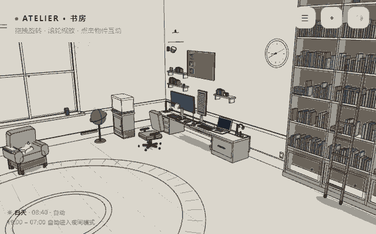
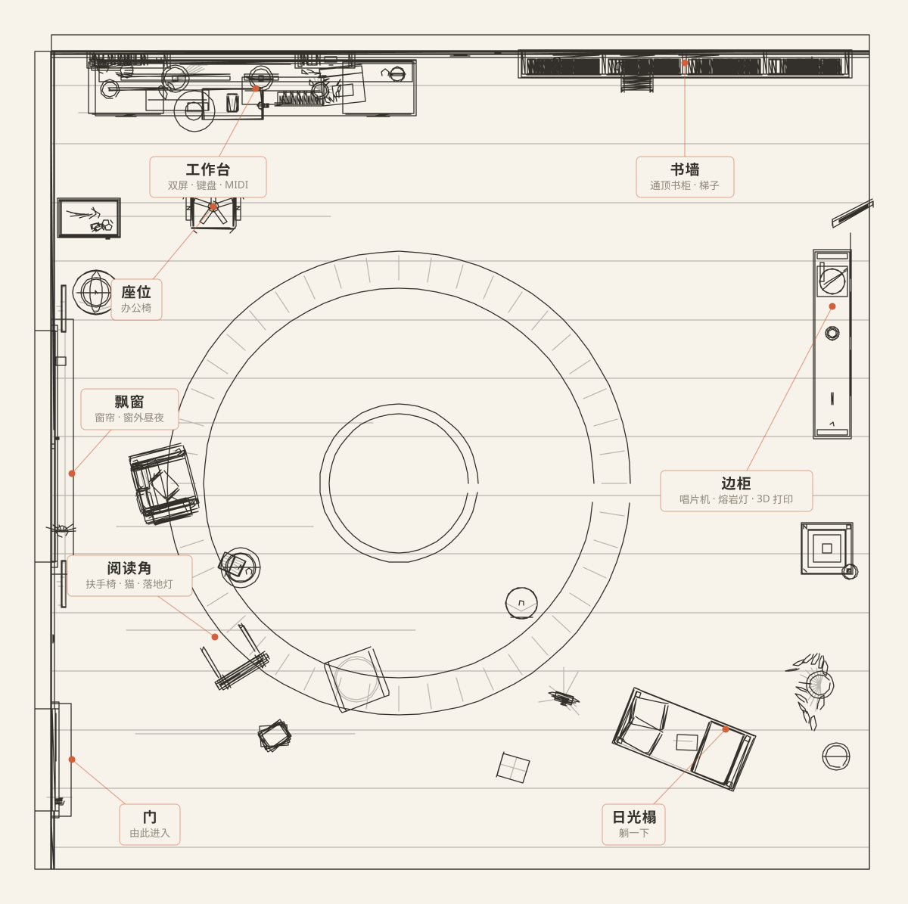
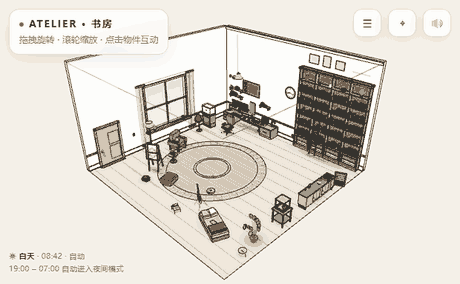

<!--
  ATELIER · 书房 — GitHub Profile README
  ============================================================================
  Design system (shared with room/ so the whole page reads as one place):

    日间  paper #f7f3eb   card #fbf8f3   ink #33302b   accent #d2603a
    夜间  bg    #14161b   wall #1e2127   ink #ede8de   accent #e07a52

  Rules: only those colours. 1.5px line work, 6px radius, no gradients, no
  neon, no emoji clutter. Every third-party widget below is re-tinted with the
  same bg / title / text trio so nothing looks imported from another theme.

  Assets are all referenced by path inside this repo (never an external image
  host) so GitHub's camo proxy can't drop them.
  ============================================================================
-->

<picture>
  <source media="(prefers-color-scheme: dark)" srcset="assets/room-night.svg">
  <source media="(prefers-color-scheme: light)" srcset="assets/room-day.svg">
  
</picture>

 

### 一间会自己亮灯的书房

19:00 – 07:00 自动进入夜间模式 &nbsp;·&nbsp; 上面的画面跟随你的系统主题切换昼夜

  

<a href="https://yan666-star.github.io/yan666-star/room/"><b>▶ 推门进来</b></a>
&nbsp;·&nbsp; 拖拽旋转 &nbsp;·&nbsp; 滚轮缩放 &nbsp;·&nbsp; 点击物件

---

## 工作台

> 一台双屏、一把会滚开的椅子、一盏天黑了自己打开的吊灯。
> 大部分时间我坐在这里，把想法写成能跑的东西。

<!-- TODO 换成你自己的介绍：目前方向 / 在学什么 / 想找什么机会 -->
关于我：做全栈，也做 AI 应用。喜欢把「能用」和「好看」当成同一件事来做 ——
这间书房本身就是一个例子：纯前端实现，没有一张图片素材，全部由线条实时绘制。

**常用工具**

---

## 书架

> 书墙是这间屋子最占地方的一件家具。以下是我放在上面的几本。

| 书名 | 讲的是什么 | 语言 |
| :--- | :--- | :--- |
| **[The-Life](https://github.com/yan666-star/The-Life)** · 人生分岔路 | Vue3 + Fastify 的全栈项目，把人生选择做成可视化的分叉路径 | Vue |
| **[competitor-intel-agent](https://github.com/yan666-star/competitor-intel-agent)** | 竞品情报智能体 —— 自动采集 · 归纳 · 输出简报 | Python |
| **[db2026](https://github.com/yan666-star/db2026)** | 数据库课程设计：从存储引擎到查询执行 | C++ |
| **[algorithm](https://github.com/yan666-star/algorithm)** | 算法练习与题解笔记 | — |
| **[langchain-academy](https://github.com/yan666-star/langchain-academy)** | 跟着 LangChain 官方的学习路径走一遍 | Jupyter |
| **[webdisplays-mc](https://github.com/yan666-star/webdisplays-mc)** | Minecraft 模组：在游戏里渲染网页（fork） | Java |

---

## 账房

> 屋主不在的时候，账房替他记账。

<!-- 第三方卡片不吃 prefers-color-scheme，所以和 Hero 一样给两套 URL 让它跟着系统主题走 -->
<picture>
  <source media="(prefers-color-scheme: dark)" srcset="https://streak-stats.demolab.com?user=yan666-star&background=14161b&ring=e07a52&fire=e07a52&currStreakLabel=4fb3ae&sideLabels=ede8de&dates=8f8a80&currStreakNum=ede8de&sideNums=ede8de&border=2a2f38">
  <source media="(prefers-color-scheme: light)" srcset="https://streak-stats.demolab.com?user=yan666-star&background=f7f3eb&ring=d2603a&fire=d2603a&currStreakLabel=3e8e8a&sideLabels=33302b&dates=8d8579&currStreakNum=33302b&sideNums=33302b&border=e0d8c8">
  
</picture>

 

 

<b>书房导览 · 平面图与俯视图</b>

 

<picture>
  <source media="(prefers-color-scheme: dark)" srcset="assets/floorplan-night.svg">
  <source media="(prefers-color-scheme: light)" srcset="assets/floorplan-day.svg">
  
</picture>

 

---

## 门牌

<!-- TODO 换成你自己的邮箱与主页；没有的整行删掉即可 -->
<a href="https://github.com/yan666-star"><b>GitHub</b></a>
&nbsp;·&nbsp;
<a href="mailto:你的邮箱@example.com"><b>Email</b></a>

---

**ATELIER · 书房** &nbsp;|&nbsp; 纯前端实现 &nbsp;·&nbsp; 无图片素材 &nbsp;·&nbsp; GMT+8

